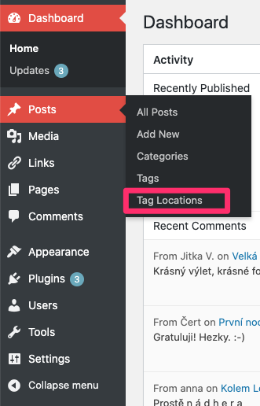
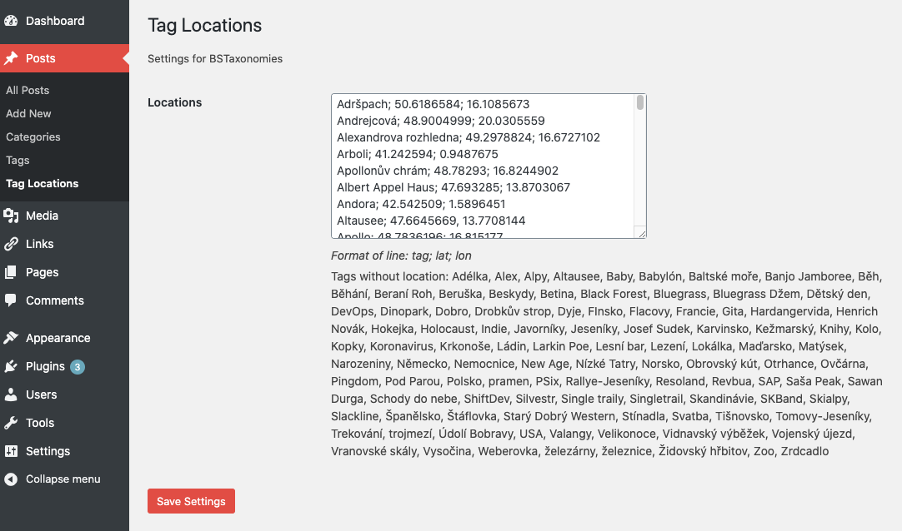
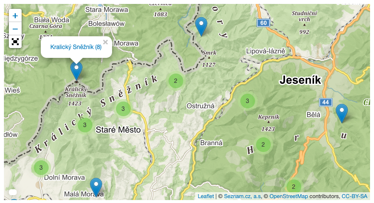

# BSTaxonomies

BSTaxonomies is a WordPress plugin, which provides new shortcode `bstaxonomies` which renders
list of various taxononimes - e.g. tags with counts of posts.

## Features and Usage

### List All Tags 

Show alphabetically sorted list of all flags.
```
[bstaxonomies]
```

### Geo Locations For Tags

Plugin extends *Post* menu of new configuration page *Tag Locations*:



This menu item allows to open new configuration page for management
of tag geo locations, where you can assign GPS coordinates to each
tag where it makes sense (tag represents some place on the Earth):



And the final step is to add map with markers:

```
[bstaxonomies type="tagmap"]
```

Each mark represents one tag for which the geo locatio is defined
(assigned). The popup window is opened by clicking on marker, where
you can see the name of the tag as well as number of tagged post and
link that opens listing of all posts. Clustering is applied in case
of many markers rendered close to each other:



## Installation

Plugin is not registered in WordPress plugin repository so it is not possible
to find it in plugin search section. You can install it by downloading zip file
from github and manually uploading via WP admin interface: `Plugins -> Add New
-> Upload Plugin`

## Development

It easy to setup development environment based on docker images.  Attached
`docker-compose.yml` allows to start containers for both wp and mysql database
with plugin mounted inside wp container. Start containers by invoking:
```
docker-compose up -d
```
Web server hosting clean WP installation should listen on `http://localhost:8080`
Editing code of the plugin is immediately visible in WP. You can visit running
container:
```
docker-compose exec wordpress bash
```
or
```
docker-compose exec mysql bash
```
To stop all containers:
```
docker-compose down
```
